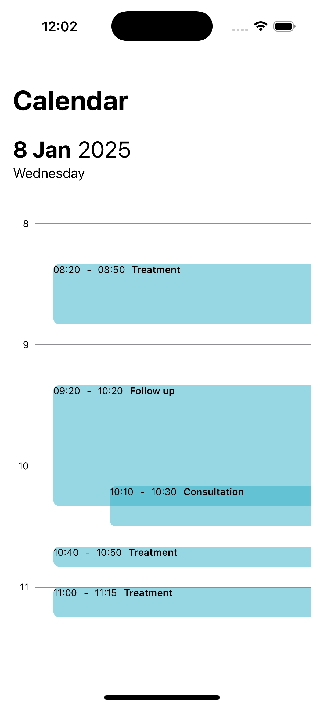
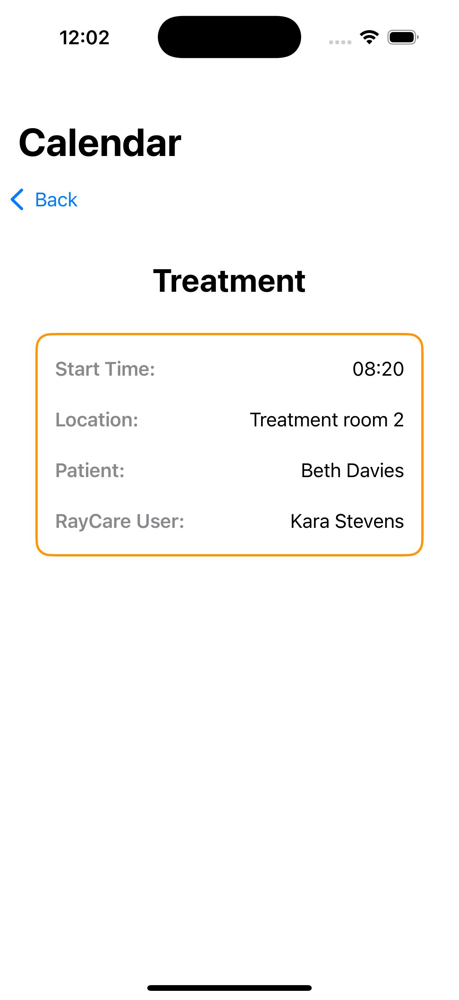

# Calendar iOS App

## Disclaimer

Author: Cecilia Humlelu. All rights reserved.

## Brief Summary

The Calendar iOS app displays a list of events in a day view. By clicking on each event, the app shows the event details. The app utilizes the latest implementation of SwiftUI and the Combine framework. The data is loaded from local JSON files but is treated as if it were coming from REST endpoints. This means:
- Operations are asynchronous using `async/await` methods.
- Concurrency is ensured when fetching data from multiple endpoints.
- Data is cached after a successful fetch.
- Error handling is properly propagated.

## Result

### Day View 

### Appointment View 

## App Structure 

### UI
- **RCDayView.swift**: Responsible for rendering the events in a day view.
- **RCAppointmentDetailView.swift**: Responsible for rendering the event details.

### View Models
- **RCDayViewModel.swift**: Bridges the appointment/event model and the day view.
- **RCAppointmentViewModel.swift**: Bridges the event detail model and the event detail view.

### DataLoader 
- **RCDataLoader.swift**: Solely responsible for handling data requests.

### Helper 
- **RCHelper.swift**: A helper class that simplifies date formatting, manages data entity types, and stores app-wide configuration values and constants.

### Test
- **RayCalTests.swift**: A unit test class for testing the data loading functionality.